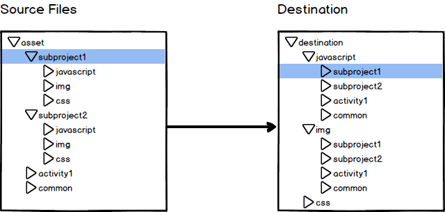

# Gulpfile Day One

This is an empty gulp project based on our practice for the last 2 years.

- [demo branch](https://github.com/alvarto/gulp-day-one/tree/demo)
- [demo output](http://alvarto.github.io/gulp-day-one/destination/index.html)

It does these stuff with normal build by tying `gulp`:

- compile jade files to html
- compile jade files to html and rename them
- compile AMD javascript entries to one file (browserify)
- copy third party files
- compile less files
- copy other files
- look out for changes and do previous task(s) again

Additionally, when type those command manually:

- `gulp svg`: combine svg files so you can inline them
- `gulp sprite`: make sprites or @2x sprites (using [glue.py](https://github.com/jorgebastida/glue))
You need to install glue first
- `gulp font`: subset font files based on the charecters needed (using [sfntly](https://github.com/googlei18n/sfntly))
JRE 7+ required

# Bathtub thoughts behind this

When using gulp, you copy and paste gulpfile in between projects. What if we use same gulpfile for different projects (coz we lazy)? How do we organize folders? This project tries to answer these questions.

## Folder pattern



In order to form this kind of gulp folder pipeline, we need to extract folder pattern. This is where `node-glob` fails us. Pattern information are lost after the matching.
I've found another way to express folder inputs and outputs, the express.js-route-like way of expressing:

```
// source can be expressed as
asset/:project/javascript/:file
// dist can be expressed as
destination/javascript/:project/
```

These infomation are stored in `/bin/globs.js`. Check them out.

## Folders

- `/bin/`: Whatever a workflow requires but a frontend page doesn't require, it's here. 
- `/asset/`: Every assets but the bundled js files
- `/javascript/`: The bundled js files. It's seprated from the `/asset/` because the base folder of `require()` is `__dirname`. To skip the ugliness of using a hell lot of `require("../../../common/stuff.js")` or `require(COMMON_PATH + "/common/stuff.js")`, we simply, put, them, here. In one place.
- `/destination/`: Auto-generated target files lie here
